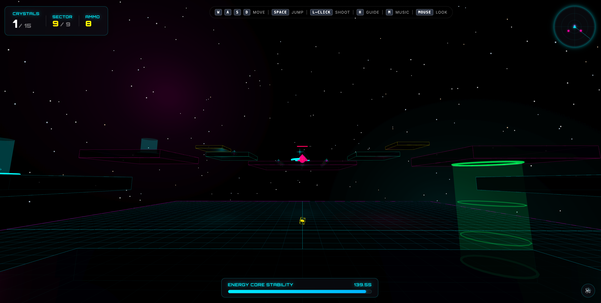

# Neon Crystal Collector

A 3D first-person browser game built with [Three.js](https://threejs.org/) and [Vite](https://vitejs.dev/). Navigate a neon, cyberpunk-styled grid across six sectors, collect energy crystals before the core destabilizes, dodge lasers and sentinel drones, and chain combos for high scores.



## Gameplay

You drop into a futuristic platform suspended in deep space. Each sector requires you to collect a number of floating crystals before the **Energy Core Stability** timer runs out. Fall off the edge and the core connection is lost.

- **Six sectors** of increasing complexity:
  1. **Arena Grid** — flat arena with monolith columns
  2. **Elevators & Lasers** — static and moving platforms, cycling laser barriers
  3. **Drones & Portals** — paired teleporters, patrolling AI guards
  4. **Gravity Lifts** — vertical traversal and speed pads
  5. **Sentinel Keep** — searchlights, timed gates, fading platforms
  6. **Glitch Void** — central sweepers and the toughest layout

- **Combat & ammo** — left-click to shoot projectiles at sentinel drones (2 HP each). Drones evaporate on death with a spinning ascent dissolve.
- **Combo system** — chain crystal pickups within the combo window for score multipliers.
- **High score** persisted to `localStorage`.

## Controls

| Input | Action |
|---|---|
| `W` `A` `S` `D` / Arrow keys | Move |
| Mouse | Look (pointer-lock) |
| `Space` | Jump (double-jump supported) |
| Left-click | Shoot |
| `H` | Toggle holographic navigation guides |
| `M` | Toggle background music |
| `L` | Sector select overlay (debug) |

## Getting Started

### Prerequisites
- Node.js (with `npm`)

### Install and run
```bash
npm install
npm run dev
```

Vite will print a local URL (typically `http://localhost:5173`). Open it in a modern WebGL-capable browser and click **Initialize Core**.

### Build for production
```bash
npm run build
npm run preview
```

Output is emitted to `dist/`.

## Deploy (GitHub Pages)

This repository includes a workflow at `/home/runner/work/neon-crystal-game/neon-crystal-game/antonarhipov/neon-crystal-game/.github/workflows/deploy.yml` that builds and deploys the game to GitHub Pages.

1. In the GitHub repository, open **Settings → Pages**.
2. Under **Build and deployment**, select **Source: GitHub Actions**.
3. Push to `main` (or run the **Deploy to GitHub Pages** workflow manually).
4. The site will be published at:
   - `https://antonarhipov.github.io/neon-crystal-game/`

## Project Structure

```
.
├── index.html          # HUD layout, overlay screens, canvas mount
├── src/
│   ├── main.js         # GameApp: state machine, render loop, scoring
│   ├── world.js        # Level geometry: platforms, portals, lasers, drones
│   ├── controls.js     # PlayerControls: pointer-lock, movement, jumping, physics
│   ├── audio.js        # AudioManager: music and SFX
│   ├── particles.js    # ParticleSystem: trails, sparks, evaporation FX
│   ├── style.css       # Cyberpunk HUD styling (neon glows, glass panels)
│   └── assets/
├── public/             # favicon and static SVGs
├── neon-crystal-screenshot.png  # gameplay screenshot used in this README
└── package.json
```

## Tech Stack

- **[Three.js](https://threejs.org/)** `^0.184.0` — WebGL rendering, scene graph, `PointerLockControls`
- **[Vite](https://vitejs.dev/)** `^8` — dev server and bundler
- Vanilla JavaScript (ES modules), no framework on the UI layer

## License

Private project — no license specified.
