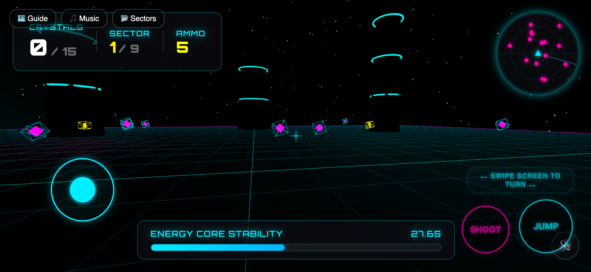

# Neon Crystal Collector

A 3D first-person browser game built with [Three.js](https://threejs.org/) and [Vite](https://vitejs.dev/). Navigate a neon, cyberpunk-styled grid across nine sectors, collect energy crystals before the core destabilizes, shoot sentinel drones, evade security systems, and chain combos for high scores.

### Desktop Version


### Mobile Version (PWA Standalone)


## Gameplay

You drop into a futuristic platform suspended in deep space. Each sector requires you to collect a number of floating crystals before the **Energy Core Stability** timer runs out. Fall off the edge and the core connection is lost.

- **Nine sectors** of increasing complexity:
  1. **Arena Grid** — Flat arena with monolith columns; basic movement and combat training.
  2. **Elevators & Lasers** — Static and moving platforms, cycling laser barriers.
  3. **Drones & Portals** — Patrolling sentinel drones (2 HP) and pair-linked teleporter pads.
  4. **The Kinetic Circuit** — Vertical gravity lifts and directional velocity booster pads.
  5. **The Sentinel Keep** — Maze corridors with moving searchlights, sirens, and alarm security systems.
  6. **The Glitch Void** — Collapsing fading platforms and central rotating laser sweepers.
  7. **Shifting Hologram Grid** — Shootable interactive switches, phased platforms, and holographic decoy drones (1 HP).
  8. **Gravitational Nexus** — Purple gravity inversion fields (reversing gravity direction) and destructible force barriers.
  9. **The Hyperloop Core** — A dual-wing platforming route leading to a final boss fight with the Nexus Overseer (6 HP) protected by rotating shields and firing homing missiles.

- **Combat & Ammo** — Left-click to shoot projectiles at drones and bosses. Drones feature real-time 3D health percentage labels, squash/flash on impact, and spin-evaporate upon destruction. Ammo crates are scattered across levels and respawn automatically after 10 seconds.
- **Combo System** — Chain crystal pickups within a short time window to increase your score multiplier.
- **Holographic Guides** — Toggles holographic guides showing the flight trajectories and path guides.
- **High Score** persisted to `localStorage`.

---

## Mobile Support & Progressive Web App (PWA)

The game features full mobile playability on smartphones and tablets:
- **Auto-Device Detection**: Seamlessly switches between desktop and touch layout profiles on load.
- **Fixed Virtual Joystick**: Positioned at the bottom-left corner for smooth analog movement physics.
- **Look Swipe Trackpad**: Swipe-dragging on the right screen rotates the camera, clamped vertically to prevent flips. Includes a pulsing visual swipe guide above action buttons.
- **Instant Actions Buttons**: Large JUMP and SHOOT buttons in the bottom-right corner use latency-free touch listeners.
- **Responsive Layout**: Automatically hides detailed instructions grids and description text in mobile landscape views to maximize canvas space.
- **Installable PWA**: Link metadata and standalone configurations allow users to install the game on their home screens for immersive fullscreen landscape play.

---

## Controls

### Desktop Controls

| Input | Action |
|---|---|
| `W` `A` `S` `D` / Arrow keys | Move |
| Mouse | Look (pointer-lock) |
| `Space` | Jump (double-jump supported) |
| Left-click | Shoot / Trigger switch |
| `H` | Toggle holographic navigation guides |
| `M` | Toggle background music |
| `L` | Sector select overlay (debug/level select menu) |

### Mobile Controls

| Touch Input | Action |
|---|---|
| **Fixed Joystick** (bottom-left) | Move |
| **Swipe Screen** (right side) | Look / Turn |
| **JUMP Button** (bottom-right) | Jump (Double-jump supported) |
| **SHOOT Button** (bottom-right) | Shoot / Trigger switch |
| **Guide / Music / Sectors** (top-left) | HUD Toggles & Menu Overlay |

---

## Getting Started

### Prerequisites
- Node.js (with `npm`)

### Install and run
```bash
npm install
npm run dev
```

Vite will print a local URL (typically `http://localhost:5173`). Open it in a modern WebGL-capable browser and click **Initialize Core**.

### Build for production
```bash
npm run build
npm run preview
```

Output is emitted to `dist/`.

## Deploy (GitHub Pages)

This repository includes a workflow at `.github/workflows/deploy.yml` that builds and deploys the game to GitHub Pages.

1. In the GitHub repository, open **Settings → Pages**.
2. Under **Build and deployment**, select **Source: GitHub Actions**.
3. Push to `main` (or run the **Deploy to GitHub Pages** workflow manually).
4. The site will be published at your domain or pages subdirectory (e.g. `https://antonarhipov.github.io/neon-crystal-game/`).

## Reachability & Path Verification

The project includes an automated pathfinding and reachability verification script. It uses a Breadth-First Search (BFS) algorithm to verify that all platforms, crystals, and portals in every sector are 100% reachable under the player's physical constraints (movement speed, jump heights, elevator timings, portals, and gravity fields).

To run the verification test:
```bash
node verify-reachability.js
```

## Project Structure

```
.
├── index.html            # HUD layout, overlay screens, canvas mount, meta head
├── src/
│   ├── main.js           # GameApp: state machine, render loop, collision logic
│   ├── world.js          # Level geometry: platforms, portals, lasers, drones, boss
│   ├── controls.js       # PlayerControls: pointer-lock, movement, touch swipe, physics
│   ├── audio.js          # AudioManager: synthesizes sound FX and background music
│   ├── particles.js      # ParticleSystem: trails, sparks, drone evaporation FX
│   └── style.css         # Cyberpunk HUD styling (neon glows, glass panels, mobile)
├── public/               # favicon, static SVGs, and manifest.json
│   └── manifest.json     # PWA manifest settings (landscape, standalone display)
├── neon-crystal-screenshot.png    # gameplay desktop screenshot used in this README
├── neon-crystal-mobile.png        # gameplay mobile screenshot used in this README
├── verify-reachability.js         # reachability validation test suite
└── package.json
```

## Tech Stack

- **[Three.js](https://threejs.org/)** `^0.184.0` — WebGL rendering, scene graph, `PointerLockControls`
- **[Vite](https://vitejs.dev/)** `^8` — dev server and bundler
- Vanilla JavaScript (ES modules)

## License

Private project — no license specified.
